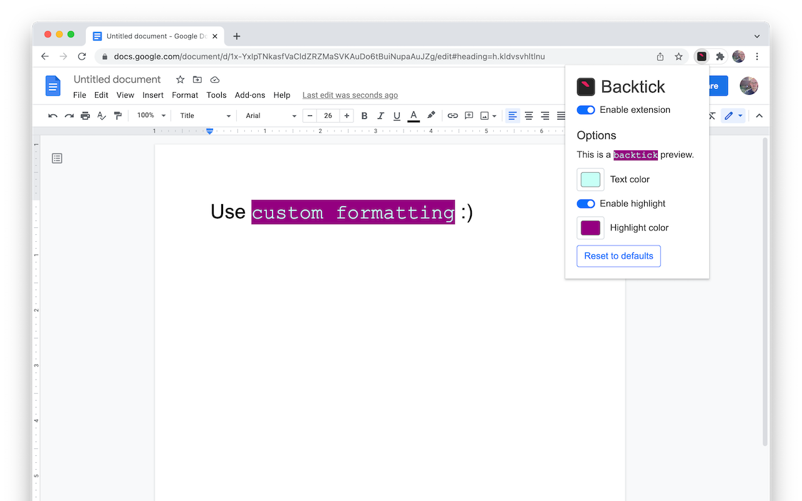
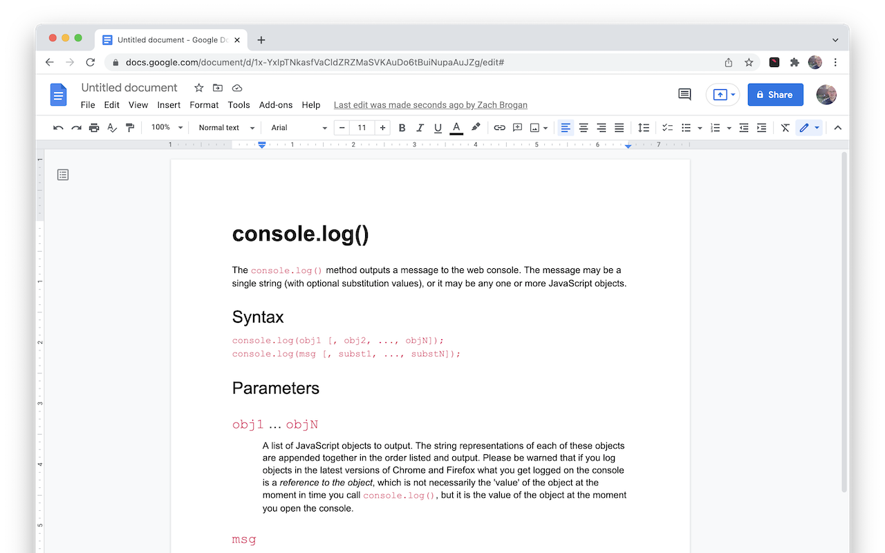
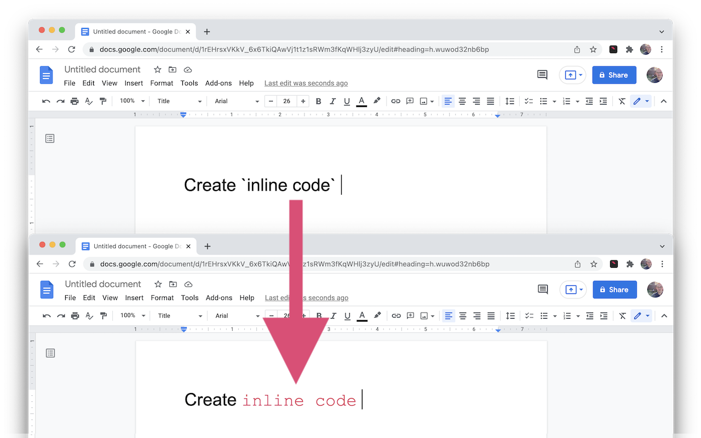

# Home

Backtick is Chrome extension that enables you to write inline code inside Google Docs. Just enclose a word or phrase with \`backticks\` and it will be automatically formatted as `inline code`. A great tool for software developers who are used to the feature in Slack, Github, Jira, Markdown files, etc.


## Features

-   Auto-format inline code using backticks
-   Customizable text color
-   Customizable highlight color
-   Extension on/off toggle
-   Support for multiple Google accounts
-   Secure and private. Docs data is processed client-side.

## Planned Features:

-   Add multi-line code blocks using markdown-style triple backtick syntax. Ex)

````
```javascript
console.log('hello!');
```
````

-   Syntax highlighting in multiple programming languages for code blocks
-   Theme choices for code blocks

## Technical Limitations

Due to the way the Google Docs API was designed, there are some limitations to this extension:

-   The extension has no notion of where your cursor is and will parse the document from bottom to top. Because of this, at most one inline code section is created per backtick key press to avoid large amounts unwanted formatting.
-   Take care when dealing with large or collaborative documents that may have existing backtick characters. Remember that the extension has a disable toggle for turning it off until it's needed again.
-   To "escape" backtick characters in your document, format each backtick character differently from the surrounding text. For example, bolding the `s, but leaving text before and after unbolded will hide the characters from the extension.
-   The formatting will happen more quickly when typing another character immediately after pressing the closing backtick character. The reason is complicated, but is essentially to preserve the existing text formatting and avoid extraneous spaces.

## [Privacy Policy](./privacy-policy.md)

## Screenshots






## [Demo Video](https://www.youtube.com/watch?v=pnAQnVqd-wA)
